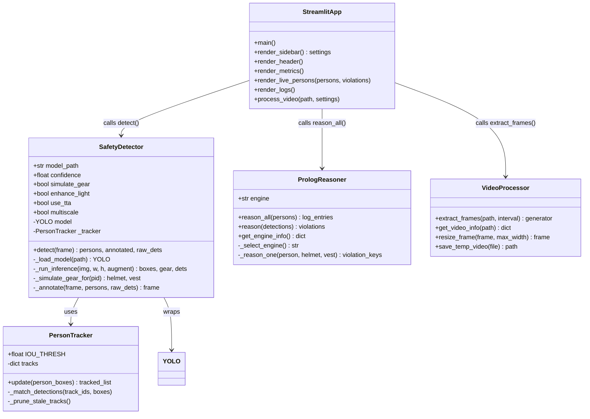
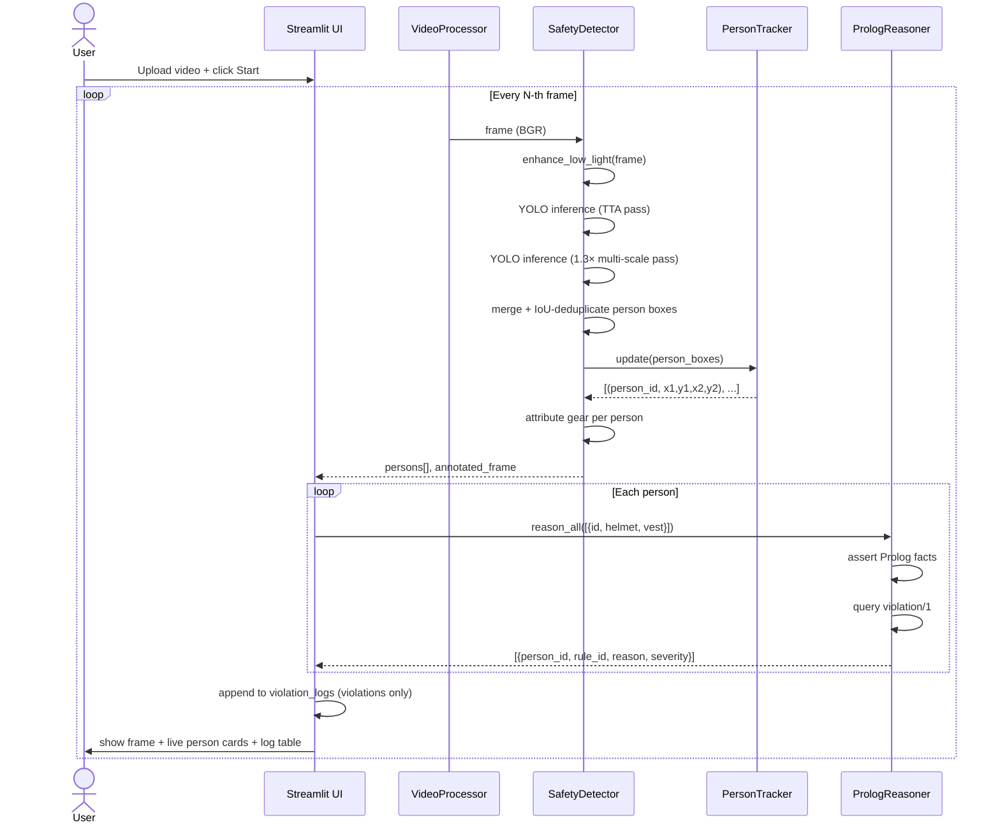
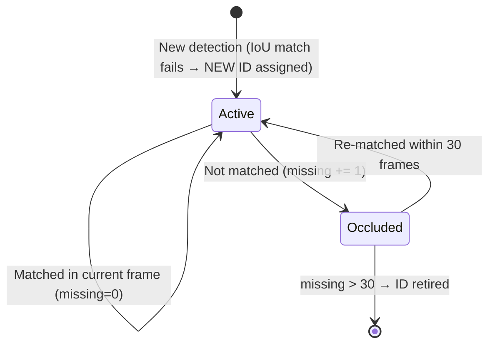

# 🛡️ Neuro-Symbolic AI Safety Inspector

> **Computer Vision × Logic Reasoning × Explainable AI**  
> Real-time, per-person workplace safety monitoring powered by YOLOv8, Prolog symbolic rules, and a Streamlit dashboard.

---

## 📋 Table of Contents

1. [Project Overview](#-project-overview)
2. [Key Features](#-key-features)
3. [System Architecture](#-system-architecture)
4. [UML Diagrams](#-uml-diagrams)
5. [Prerequisites](#-prerequisites)
6. [Installation](#-installation)
7. [Running the App](#-running-the-app)
8. [How It Works](#-how-it-works)
9. [Project Structure](#-project-structure)
10. [Configuration & Tuning](#-configuration--tuning)

---

## 🔍 Project Overview

The **Neuro-Symbolic AI Safety Inspector** is a hybrid AI system that combines:

- 🤖 **Neural perception** — YOLOv8 deep learning model detects persons in video frames with maximal accuracy, even in dim or harsh lighting conditions.
- 🧠 **Symbolic reasoning** — A Prolog knowledge base evaluates logical safety rules (mandatory helmet, mandatory vest) against each detected individual.
- 🔖 **Per-person tracking** — Every person receives a **random, persistent alphanumeric ID** (e.g. `A3F9K2`) that is maintained across frames using an IoU-based centroid tracker.
- 📋 **Clean violation logs** — Only rule breaches are logged, tagged with the exact Person ID and the rule violated (e.g. `R-01: Helmet is mandatory in work zone`).
- 🌙 **Low-light robustness** — A 4-stage preprocessing pipeline (auto-gamma → bilateral filter → CLAHE → unsharp mask) ensures reliable detection in dark or dim environments.

This project demonstrates the **neuro-symbolic AI** paradigm: neural networks handle messy real-world perception, while symbolic logic provides explainable, auditable rule enforcement.

---

## ✨ Key Features

| Feature | Detail |
|---|---|
| **Per-person IDs** | Random 6-char alphanumeric ID assigned on first appearance, persists across frames |
| **Rule violation logs** | Only violations shown — Person ID · Rule ID · Rule text · Severity · Frame number |
| **Low-light pipeline** | Auto-gamma + Bilateral filter + CLAHE + Unsharp mask |
| **Max-accuracy detection** | YOLOv8m (auto-download), TTA, multi-scale 1.3× second pass, confidence 0.25 |
| **IoU tracker** | Centroid-based tracker survives brief occlusions (up to 30 frames) |
| **Prolog reasoning** | 3 safety rules with severity levels (critical / high / medium) |
| **Explainability** | Every violation links back to a named rule with a human-readable reason |
| **CSV export** | Download full violation log as CSV |

---

## 🏗️ System Architecture

```
┌─────────────────────────────────────────────────────────────────────┐
│                        VIDEO INPUT (MP4/AVI/MOV)                    │
└───────────────────────────────┬─────────────────────────────────────┘
                                │  Frame extraction (every N-th frame)
                                ▼
┌─────────────────────────────────────────────────────────────────────┐
│               LOW-LIGHT PREPROCESSING PIPELINE                      │
│   Auto-Gamma → Bilateral Filter → CLAHE (L-channel) → Unsharp Mask │
└───────────────────────────────┬─────────────────────────────────────┘
                                │  Enhanced BGR frame
                ┌───────────────┴──────────────┐
                │  Primary pass (TTA=True)      │  Multi-scale pass (1.3×)
                ▼                               ▼
┌───────────────────────┐       ┌───────────────────────────────────┐
│  YOLOv8m Inference    │       │  YOLOv8m Inference (upscaled)     │
│  conf=0.25 (person)   │       │  re-project → orig coordinates    │
└───────────┬───────────┘       └────────────────┬──────────────────┘
            └──────────────────┬─────────────────┘
                               │  Merged + IoU-deduplicated boxes
                               ▼
┌─────────────────────────────────────────────────────────────────────┐
│                        IoU CENTROID TRACKER                         │
│  Matches boxes across frames · Assigns/maintains random person IDs  │
└───────────────────────────────┬─────────────────────────────────────┘
                                │  [(person_id, x1, y1, x2, y2), ...]
                                ▼
┌─────────────────────────────────────────────────────────────────────┐
│              PER-PERSON GEAR ATTRIBUTION                            │
│  Checks helmet/vest proxy boxes overlap with each person box        │
│  Result: {id, helmet:bool, vest:bool}  per person                  │
└───────────────────────────────┬─────────────────────────────────────┘
                                │  Person list
                                ▼
┌─────────────────────────────────────────────────────────────────────┐
│              PROLOG SYMBOLIC REASONER                               │
│  For each person, asserts facts and queries rules:                  │
│    R-01  violation(no_helmet)   → severity: high                    │
│    R-02  violation(no_vest)     → severity: medium                  │
│    R-03  violation(no_equipment)→ severity: critical                │
│  Strategy: PySwip → subprocess swipl → Pure-Python fallback         │
└───────────────────────────────┬─────────────────────────────────────┘
                                │  [{ person_id, rule_id, reason, severity }]
                                ▼
┌─────────────────────────────────────────────────────────────────────┐
│               STREAMLIT DASHBOARD (app.py)                          │
│  • Annotated live frame   • Per-person status cards                 │
│  • Violation log table    • Metrics (persons, violations, FPS)      │
│  • CSV download button                                              │
└─────────────────────────────────────────────────────────────────────┘
```

---

## 📐 UML Diagrams

### Class Diagram



### Sequence Diagram — Processing One Frame



### State Machine — Person Track Lifecycle



---

## ✅ Prerequisites

| Requirement | Version | Notes |
|---|---|---|
| **Python** | 3.9 – 3.11 | 3.11 recommended |
| **pip** | latest | `python -m pip install --upgrade pip` |
| **SWI-Prolog** *(optional)* | 9.x | Only needed for real Prolog reasoning. Pure-Python fallback works without it. |

> Download SWI-Prolog from [https://www.swi-prolog.org/Download.html](https://www.swi-prolog.org/Download.html) and ensure `swipl` is on your system PATH.

---

## ⚙️ Installation

### 1. Clone the repository

```bash
git clone https://github.com/dhanush106/Neuro-Symbolic-AI-Safety-Inspector.git
cd Neuro-Symbolic-AI-Safety-Inspector
```

### 2. Create and activate a virtual environment *(recommended)*

```bash
# Windows
python -m venv .venv
.venv\Scripts\activate

# macOS / Linux
python -m venv .venv
source .venv/bin/activate
```

### 3. Install Python dependencies

```bash
pip install -r requirements.txt
```

> **Note:** On first run, `ultralytics` will automatically download **YOLOv8m** weights (~50 MB) from the internet. If download fails, it falls back to **YOLOv8n** which is already included (`yolov8n.pt`).

### 4. *(Optional)* Verify SWI-Prolog

```bash
swipl --version
```

If not installed, the system automatically uses the built-in **Pure-Python rule engine** — all features still work.

---

## 🚀 Running the App

```bash
streamlit run app.py
```

The app opens in your browser at **http://localhost:8501**

### Workflow

1. **Upload a video** — drag and drop an MP4/AVI/MOV/MKV file
2. **Adjust settings** in the sidebar:
   - *Process every Nth frame* — lower = more accurate, slower
   - *Low-light enhancement* — toggle CLAHE pipeline
   - *TTA* — test-time augmentation (best accuracy)
   - *Multi-scale pass* — catches small/distant persons
3. **Click ▶️ Start Processing**
4. Watch the **annotated live frame** (each person has a coloured bounding box + ID)
5. Monitor the **Live Person Status** panel — real-time gear status per ID
6. Review the **Violation Log table** — only breaches are shown
7. **Download Violation Log (CSV)** for reporting

---

## 🔬 How It Works

### Neural Layer — Person Detection

YOLOv8m runs with a **person-specific confidence threshold of 0.25** (much lower than the standard 0.45) to maximise recall. Two passes are run per frame:

- **Pass 1** — TTA-enabled inference on the preprocessed frame
- **Pass 2** — Inference on a 1.3× upscale to catch small/distant people

Results are merged and IoU-deduplicated before tracking.

### Low-Light Pipeline

```
Raw frame
  └─ Auto-Gamma      (lifts dark frames: mean brightness target 45%)
       └─ Bilateral Filter   (denoise without blurring edges)
            └─ CLAHE on L-ch  (local contrast in LAB colour space)
                 └─ Unsharp Mask  (restore detector-critical edges)
```

### Tracking Layer — Random Person IDs

An IoU centroid tracker matches each detection to existing tracks:
- **Match** (IoU ≥ 0.25) → same ID, `missing` counter reset
- **No match** → new 6-char random ID generated (e.g. `K7M2P9`)
- **Absent > 30 frames** → track retired, ID freed

### Symbolic Layer — Prolog Rules

```prolog
violation(no_helmet)    :- person_detected, \+ wearing_helmet.
violation(no_vest)      :- person_detected, \+ wearing_vest.
violation(no_equipment) :- person_detected, \+ wearing_helmet, \+ wearing_vest.

severity(no_helmet,    high).
severity(no_vest,      medium).
severity(no_equipment, critical).
```

Rules are evaluated **per person**, per frame. Only violations are emitted to the log.

---

## 📁 Project Structure

```
Neuro-Symbolic-AI-Safety-Inspector/
├── app.py                        # Streamlit main application
├── requirements.txt              # Python dependencies
├── yolov8n.pt                    # YOLOv8 nano weights (fallback)
│
├── vision/
│   ├── __init__.py
│   └── detect.py                 # SafetyDetector — YOLO + preprocessing
│
├── tracking/
│   ├── __init__.py
│   └── tracker.py                # PersonTracker — IoU centroid tracker
│
├── logic/
│   ├── __init__.py
│   └── prolog_interface.py       # PrologReasoner — PySwip / subprocess / fallback
│
├── prolog/
│   └── rules.pl                  # Prolog knowledge base (safety rules)
│
└── utils/
    ├── __init__.py
    └── video_processing.py       # Frame extraction, resize, video info
```

---

## 🎛️ Configuration & Tuning

| Setting | Where | Default | Effect |
|---|---|---|---|
| Person confidence | `detect.py → PERSON_CONF` | `0.25` | Lower = more recall, more false positives |
| Non-person confidence | Sidebar slider | `0.45` | Filter gear proxy detections |
| TTA | Sidebar toggle | `ON` | Best accuracy, ~2× slower |
| Multi-scale pass | Sidebar toggle | `ON` | Catches small persons, ~1.5× slower |
| Low-light enhancement | Sidebar toggle | `ON` | Essential for dim videos |
| Frame interval | Sidebar slider | `5` | Process every 5th frame |
| CLAHE clip limit | `detect.py → clahe` | `3.5` | Higher = more aggressive contrast |
| Tracker IoU threshold | `tracker.py → IOU_THRESH` | `0.25` | Lower = more lenient matching |
| Max missing frames | `tracker.py → MAX_MISSING` | `30` | Frames before ID is retired |

---

## 🧾 Violation Log Format

The CSV export and on-screen table contain only rule-breaching entries:

| Column | Example | Description |
|---|---|---|
| `timestamp` | `0:00:02` | Video timestamp of the frame |
| `frame` | `10` | Frame number |
| `person_id` | `A3F9K2` | Random persistent person ID |
| `rule_id` | `R-01` | Safety rule identifier |
| `violation` | `no_helmet` | Rule key |
| `reason` | `Helmet is mandatory in work zone` | Human-readable explanation |
| `severity` | `high` | critical / high / medium |

---

*Built with [Streamlit](https://streamlit.io) · [Ultralytics YOLOv8](https://github.com/ultralytics/ultralytics) · [SWI-Prolog](https://www.swi-prolog.org)*
